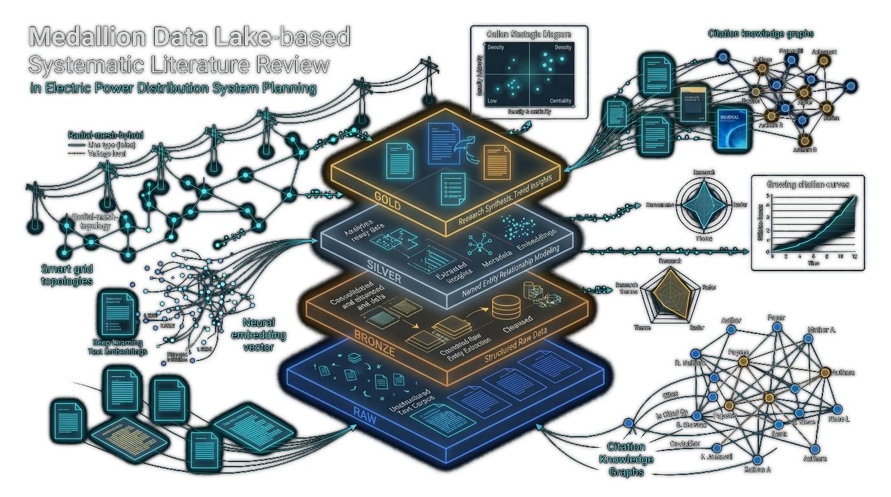

# lake-literature



Writing a new article on **"distribution system planning"** (electric power distribution networks) means
knowing, out of several hundred candidate papers scattered across publisher databases, which ones are
actually worth citing. `lake-literature` turns hand-assembled bibliographic exports from IEEE Xplore and
Elsevier/ScienceDirect into a clean, deduplicated, RAG-ready corpus that answers that question — without
anyone having to query MySQL directly.

For the full product rationale see [`docs/PRD.md`](docs/PRD.md); for the system design see
[`docs/SDD.md`](docs/SDD.md); for guidelines and agent conventions see [`AGENTS.md`](AGENTS.md); for the
exact quirks of the source data (BibTeX parsing gotchas, DOI format differences, lossy PDF filename
matching) see [`CLAUDE.md`](CLAUDE.md).


## Why this exists

Doing this by hand from raw publisher exports is unmanageable:

- The two publishers export different formats (CSV+BibTeX vs. BibTeX-only), different field names, different
  DOI formats, and different pagination conventions.
- A paper indexed by both publishers would survive deduplication twice without a reliable join key — DOI,
  normalized, is that key. (On the current corpus that overlap happens to be zero: 1,529 articles from
  Elsevier, 302 from IEEE, none in both. The duplication that *does* exist is 18 near-identical abstracts
  under distinct DOIs, which the `semantic` stage surfaces instead.)
- Counts never line up: 304 IEEE CSV rows and 1,815 BibTeX entries ingest to 1,836 bronze records, 1,831
  survive DOI deduplication, and 96 have a PDF. The corpus is inherently partial — a fact the pipeline has
  to represent, not paper over.
- The query itself is ambiguous: "distribution system planning" also matches logistics and supply-chain
  work, so screening the corpus for relevance is part of the job, not an afterthought.
- There was no single place to see corpus composition, quality, and coverage at a glance, or to know which
  papers have full text available for deeper analysis.

## Data sources

| | IEEE Xplore | ScienceDirect / Elsevier |
|---|---|---|
| Format | metadata CSV + paginated `.bib` files | paginated `.bib` files only |
| Full text | ~96 PDFs (from the bulk-download zips) | none |

The corpus (`data/`) is not checked into git — it's raw publisher output assembled manually, treated as
read-only input by the pipeline. See [`CLAUDE.md`](CLAUDE.md) for the parsing gotchas specific to each source
(BibTeX entries with no separator between them, lossy PDF-to-title matching, DOI format differences, etc.).

## Dashboard

A **Streamlit dashboard** (`src/lake_literature/dashboard/`) visualizes the corpus at every pipeline stage,
across thirteen modular pages organized with **strict chart deduplication** across tabs:

| Page | What it shows |
|---|---|
| Overview | headline corpus counts, source distribution, publication-year spread, and editorial concentration macro summaries |
| Output Over Time | strictly chronological views: annual volume, cumulative growth by journal, IEEE vs. Elsevier comparison, and Qualis strata evolution |
| Topics & Venues | unified journal ranking (volume vs impact toggle), CAPES/Qualis classification, Bradford zones, semantic centroids, Zipf's law, dynamic c-TF-IDF, conceptual atypicality, and Chow structural breaks |
| Highlights & Impact | theoretical foundations (distribution viewer, top referenced) and citation dynamics & econometrics (top cited, citations by year, heavy-tail MLE, age-normalized percentiles, Poisson GLM) |
| Researchers | definitive Author Hub: productivity ranking, scientific leadership ($h, g, e, m$-indices), career trajectory, co-authorship Louvain network & small-world topology, research lines, and Lotka's law |
| Semantics & Relevance | relevance screening against both readings of the query, multi-projection 2D map (t-SNE/UMAP/PCA), discovered themes, novelty score, and duplicate pairs |
| Trends & Forecast | regression-based volume forecasts with dynamic expanding prediction intervals ($\sigma \sqrt{h}$), rolling-origin CV, keyword trajectories, and continuous Bass innovation diffusion |
| Strategic Scientometrics | Callon's strategic diagram (density vs. centrality), keyword co-occurrence (Jaccard + Louvain), centroid similarity ($8 \times 8$), transparent maturity radar, Spearman correlations, Shannon entropy, and international collaboration |
| Methodological Synthesis | mathematical complexity spectrum (MILP, SOCP, MINLP, AI), multi-objective co-optimization taxonomy, uncertainty modeling vs DER resources, planning horizons, IEEE benchmark feeders, solvers/simulators, and citation longevity & stylometrics |
| Technological Frontiers | Price's index of theoretical youth, delayed-recognition Sleeping Beauties ($B$ coefficient), Wu et al. $CD$ disruption index, Open Access citation advantage (OACA), and Kleinberg technological burst timelines |
| Layers & Pipeline | funnel + per-layer record counts and drift checks, pipeline run history (`lit_pipeline_runs`), rejected records audit (`lit_rejected`), and stage execution controls |
| Quality & RAG | metadata richness, full-text coverage, chunk/embedding readiness, Isolation Forest anomaly audit, and hybrid BM25 + dense vector search (RRF) |
| Search Configuration | the provenance recorded in each source's `config.csv` (query, filters, search URL) |

Every page's charts are organized into tabs so each page stays one screen instead of an endless scroll,
with **zero chart redundancy across tabs**. Page labels in the running app are in Portuguese; the table above
uses their English meaning.

Pipeline execution is orchestrated by **Apache Airflow**: one DAG per stage
(`lake_literature_raw/bronze/silver/gold/embed/semantic`, defined in `airflow/dags/lake_literature_dags.py`)
plus a combined `lake_literature_all` DAG that chains all six. The "Camadas & Pipeline" and "Qualidade e RAG"
dashboard pages trigger and poll these DAG runs through Airflow's REST API
(`dashboard/airflow_client.py`, `dashboard/pipeline_control.py`) instead of running the pipeline in-process,
so every run gets proper history, logs, and per-task status in the Airflow UI.

## Storage

The two publisher exports are consolidated through a **medallion architecture** — raw → bronze → silver →
gold → embed — with SQLAlchemy models. Each of the four medallion layers (`raw`, `bronze`, `silver`, `gold`)
lives in its own MySQL database, named plainly after the layer. **Those databases are shared with unrelated
projects on the same MySQL server** — the pipeline only ever creates or touches its own `lit_`-prefixed
tables within them, never anything else it finds there.

DOI is the only reliable cross-source identifier: stripping the `https://doi.org/` prefix and casefolding it
is what makes deduplication possible, because the two sources otherwise disagree on entry format, field
names, and separators.

## Quick start

Requires [uv](https://docs.astral.sh/uv/) (Python 3.13) and access to a MySQL server.

```bash
uv sync                                     # create/refresh .venv from uv.lock
cp .env.example .env                        # fill in MYSQL_HOST/PORT/USER/PASSWORD

uv run lake-literature --stage all         # full pipeline (raw -> bronze -> silver -> gold -> embed -> semantic)
uv run lake-literature --stage embed       # or run just one stage on its own
uv run lake-literature --stage semantic    # relevance screening, themes and the semantic map
uv run streamlit run main.py                # dashboard at http://localhost:8501
```

### With Airflow orchestration

```bash
docker compose up -d
```

This starts two services: `airflow` (a single-container `airflow standalone` instance at
`http://localhost:8080`, DAGs pre-loaded from `airflow/dags/`) and `dashboard` (Streamlit at
`http://localhost:8501`, wired to trigger those DAGs). Both read MySQL connection settings from `.env`, which
neither service bakes into its image.

## Testing & linting

```bash
uv run pytest        # tests/ — pure transform logic + bronze/silver/gold builders against in-memory SQLite
uv run ruff check     # lint (E, F, I, UP, B rulesets; see pyproject.toml)
```

The suite (`tests/`) contains **186 automated tests across 22 test files**, covering DOI normalization,
bronze/silver dedup and merge logic, PDF fuzzy-matching, gold chunking, CAPES/Qualis venue matching,
pure analytics aggregations, heavy-tail distributions, complex network topologies, machine learning models,
strategic scientometrics, methodological synthesis, technological frontiers, BM25 Okapi & RRF hybrid search,
continuous Bass NLS diffusion, structural breaks, conceptual atypicality, and Faiss vector indexing — all
against in-memory SQLite, so none of it needs a live MySQL server. It does not cover file parsing against the
real (gitignored) `data/` corpus — those stay manually verified.

## Git hooks

After cloning, install the hooks once:

```bash
uv tool install pre-commit   # or: pip install pre-commit
pre-commit install
```

This enables two checks on every `git commit`:
- **gitleaks** — scans the staged diff for secrets (passwords, API keys, tokens, private keys) and blocks the
  commit if it finds anything.
- **block-docs-on-main** (`scripts/git-hooks/check-docs-branch.sh`) — blocks commits that touch only
  documentation (`docs/`, `*.md`, `README*`, `CLAUDE.md`) when made directly on `main`, asking you to create a
  branch (`git checkout -b docs/<topic>`) first.

If you use Claude Code on this project, the automatic session snapshot (the global `auto-pr.sh` hook, which
commits/pushes with `--no-verify` at the end of every turn) also runs its own secret scan before committing —
if it finds anything, it aborts without committing or pushing, so both paths (manual and automatic commits)
are covered.

`main` is a protected branch on GitHub: force-pushes and branch deletion are disabled.

## Project layout

```
src/lake_literature/
  config.py             env/settings (MySQL + Airflow base URL)
  db/                    SQLAlchemy models and engines, one module set per medallion layer
                          (raw_models, bronze_models, silver_models, gold_models, engines, bootstrap)
  ingest/                raw-layer loaders (raw_csv, raw_bib, raw_pdfs, raw_config, openalex, hashing)
  transform/             bronze/silver/gold builders + embeddings.py (`embed`) + semantics.py (`semantic`)
                          + screening_calibration.py
  pipeline.py            CLI entrypoint (`lake-literature --stage ...`)
  dashboard/
    app.py                Streamlit entry point, page registry, navigation
    pages/                one module per page (overview, production, topics, highlights,
                           researchers, semantics, strategic, synthesis, frontiers,
                           forecasting, pipeline_layers, quality, search_config)
    airflow_client.py      thin REST client for triggering/polling Airflow DAG runs
    pipeline_control.py    dashboard-side glue between pages and airflow_client
    analytics.py, charts.py, data.py, loaders.py, forecasting.py, theme.py, components.py
airflow/dags/            DAG definitions (thin wrappers around `uv run lake-literature --stage X`)
docs/                     PRD.md, SDD.md, ROADMAP.md, images/architecture.svg
scripts/git-hooks/        local pre-commit hook scripts
tests/                    pytest suite (186 tests across 22 files, in-memory SQLite, no MySQL needed)
main.py                  root Streamlit entry point (`import lake_literature.dashboard.app`)
```

## Status

- **No duplicate DOIs** in `silver`/`gold`'s `lit_articles` after a full pipeline run over the current corpus.
- **Idempotent re-runs**: running `--stage all` twice in a row on unchanged `data/` doesn't change row counts.
- **Binary embedding efficiency**: `gold.lit_chunks.embedding_bin` stores native float32 vectors (~9 MB, ~1.5 KB/vector),
  cutting storage footprint by 82% compared to legacy JSON strings and enabling zero-copy `np.frombuffer` loads.
- **Fast vector retrieval & Hybrid Search**: accelerated vector search engine (`dashboard/search.py`) supporting
  Faiss (`IndexFlatIP`, `IndexFlatL2`), vectorized fallback, pure Python BM25 Okapi, and Reciprocal Rank Fusion (RRF)
  hybrid retrieval across binary BLOBs and lexical tokens.
- **Audited analytical engine**: 61+ pure analytical functions in `dashboard/analytics.py` audited and optimized
  for statistical rigor (weighted Louvain, inverted distance weights for path centralities, contiguous career slope
  estimation with zero-gap filling, unpenalized Poisson GLM, Weighted Least Squares Lotka fitting, vectorized matrix dot-products,
  cross-epoch global vocabulary dynamic c-TF-IDF, Chow/SSE changepoint detection, and Uzzi et al. 2013 conceptual atypicality).
- **Advanced Forecasting & Diffusion**: multi-model forecasting with dynamic expanding prediction intervals
  ($\text{margin} = 1.96 \cdot \text{residual\_std} \cdot \sqrt{h}$) and bounded non-linear least squares (`curve_fit`)
  continuous Bass innovation diffusion ($p, q, m$).
- **Relevance screening**: every article is scored against the review's topic *and* against the logistics
  reading of the same ambiguous query; the margin between them is the screening signal, and its zero is the
  cut. On the current corpus 165 of 1,831 articles (9%) fall below it, 145 of them inside the logistics
  theme. Nothing is deleted automatically — the sidebar filter is opt-in and never removes an unscored
  article.
- **Corpus refresh remains manual**: adding new export files to `data/` and re-running the pipeline is a
  deliberate, unautomated step — there is no scheduled or triggered re-scrape (see PRD §3 for the full list
  of non-goals).
- **What's next**: the strategic improvement backlog and research roadmap live in [`docs/ROADMAP.md`](docs/ROADMAP.md).
