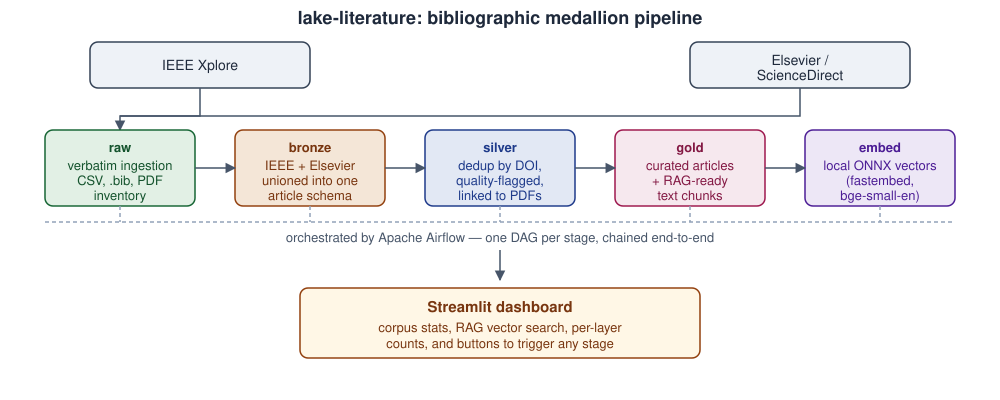

# lake-literature

`lake-literature` turns bibliographic exports on **"distribution system planning"** (electric power
distribution networks) — collected by hand from IEEE Xplore and Elsevier/ScienceDirect — into a clean,
deduplicated, queryable corpus, with the eventual goal of a RAG-ready dataset that helps decide which papers
to cite when writing a new article on the topic.

For the full product rationale see [`docs/PRD.md`](docs/PRD.md); for the system design see
[`docs/SDD.md`](docs/SDD.md); for the exact quirks of the source data (BibTeX parsing gotchas, DOI format
differences, lossy PDF filename matching) see [`CLAUDE.md`](CLAUDE.md).



## What it does

Two publisher exports are consolidated through a **medallion architecture** — five stages, four of them
backed by SQLAlchemy models sharing a single MySQL database (`medalhao`), each layer's tables kept apart by
name (see [`docs/SDD.md`](docs/SDD.md)):

```
raw       verbatim ingestion of every source file (CSV rows, BibTeX entries, PDF inventory)
   ↓
bronze    IEEE (CSV + .bib) and Elsevier (.bib) unioned into one common article schema
   ↓
silver    deduplicated by normalized DOI, quality-flagged, linked to PDFs by fuzzy title match
   ↓
gold      curated articles + RAG-ready text chunks (abstract chunks for everything, full-text
          chunks for the subset with a linked PDF)
   ↓
embed     fills lit_chunks.embedding for every chunk, entirely locally via fastembed (ONNX
          runtime, BAAI/bge-small-en-v1.5) — no API key, no GPU required
```

DOI is the only reliable cross-source identifier: stripping the `https://doi.org/` prefix and casefolding it
is what makes deduplication possible, because the two sources otherwise disagree on entry format, field names,
and separators.

A **Streamlit dashboard** (`src/lake_literature/dashboard/`) visualizes the corpus at every stage:

| Page | What it shows |
|---|---|
| Overview | headline corpus counts and composition |
| Output Over Time | publication trends by year, IEEE vs. Elsevier |
| Topics & Venues | keyword statistics with an interactive filter/explorer, venue breakdown |
| Highlights & Impact | citation distribution, most-cited/most-relevant articles |
| Researchers | author-level stats and collaboration view |
| Trends & Forecast | forecasting of publication/topic trends |
| Layers & Pipeline | per-layer record counts and pipeline run status, with buttons to trigger a stage |
| Quality & RAG | data-quality flags plus RAG-chunk/embedding-readiness gauge, with a button to run the `embed` stage directly |
| Search Configuration | the provenance recorded in each source's `config.csv` (query, filters, search URL) |

> Note: the page labels in the running app (`src/lake_literature/dashboard/app.py`) are currently in
> Portuguese; the table above uses their English meaning.

Pipeline execution is orchestrated by **Apache Airflow**: one DAG per stage
(`lake_literature_raw/bronze/silver/gold/embed`, defined in `airflow/dags/lake_literature_dags.py`) plus a
combined `lake_literature_all` DAG that chains all five. The dashboard's "Camadas & Pipeline" and "Qualidade e
RAG" pages trigger and poll these DAG runs through Airflow's REST API (`dashboard/airflow_client.py`,
`dashboard/pipeline_control.py`) instead of running the pipeline in-process, so every run gets proper history,
logs, and per-task status in the Airflow UI.

## Data sources

| | IEEE Xplore | ScienceDirect / Elsevier |
|---|---|---|
| Format | metadata CSV + paginated `.bib` files | paginated `.bib` files only |
| Full text | ~96 PDFs (from the bulk-download zips) | none |

The corpus (`data/`) is not checked into git — it's raw publisher output assembled manually, treated as
read-only input by the pipeline. See [`CLAUDE.md`](CLAUDE.md) for the parsing gotchas specific to each source
(BibTeX entries with no separator between them, lossy PDF-to-title matching, DOI format differences, etc.).

## Quick start

Requires [uv](https://docs.astral.sh/uv/) (Python 3.13) and access to a MySQL server.

```bash
uv sync                                     # create/refresh .venv from uv.lock
cp .env.example .env                        # fill in MYSQL_HOST/PORT/USER/PASSWORD/DATABASE

uv run lake-literature --stage all         # run the full pipeline (raw -> bronze -> silver -> gold -> embed)
uv run lake-literature --stage embed       # or run just the embedding stage on its own
uv run streamlit run main.py                # dashboard at http://localhost:8501
```

### With Airflow orchestration

```bash
docker compose up -d
```

This starts two services: `airflow` (a single-container `airflow standalone` instance at
`http://localhost:8080`, DAGs pre-loaded from `airflow/dags/`) and `dashboard` (Streamlit at
`http://localhost:8501`, wired to trigger those DAGs). Both read MySQL connection settings from `.env`, which
neither service bakes into its image.

## Git hooks

After cloning, install the hooks once:

```bash
uv tool install pre-commit   # or: pip install pre-commit
pre-commit install
```

This enables two checks on every `git commit`:
- **gitleaks** — scans the staged diff for secrets (passwords, API keys, tokens, private keys) and blocks the
  commit if it finds anything.
- **block-docs-on-main** (`scripts/git-hooks/check-docs-branch.sh`) — blocks commits that touch only
  documentation (`docs/`, `*.md`, `README*`, `CLAUDE.md`) when made directly on `main`, asking you to create a
  branch (`git checkout -b docs/<topic>`) first.

If you use Claude Code on this project, the automatic session snapshot (the global `auto-pr.sh` hook, which
commits/pushes with `--no-verify` at the end of every turn) also runs its own secret scan before committing —
if it finds anything, it aborts without committing or pushing, so both paths (manual and automatic commits)
are covered.

`main` is a protected branch on GitHub: force-pushes and branch deletion are disabled.

## Project layout

```
src/lake_literature/
  config.py             env/settings (MySQL + Airflow base URL)
  db/                    SQLAlchemy models and engines, one module set per medallion layer
                          (raw_models, bronze_models, silver_models, gold_models, engines, bootstrap)
  ingest/                raw-layer loaders (raw_csv, raw_bib, raw_pdfs, raw_config, enrichment, hashing)
  transform/             bronze/silver/gold builders + embeddings.py (the `embed` stage)
  pipeline.py            CLI entrypoint (`lake-literature --stage ...`)
  dashboard/
    app.py                Streamlit entry point, page registry, navigation
    pages/                one module per page (overview, production, topics, highlights,
                           researchers, forecasting, pipeline_layers, quality, search_config)
    airflow_client.py      thin REST client for triggering/polling Airflow DAG runs
    pipeline_control.py    dashboard-side glue between pages and airflow_client
    analytics.py, charts.py, data.py, loaders.py, forecasting.py, theme.py, components.py
airflow/dags/            DAG definitions (thin wrappers around `uv run lake-literature --stage X`)
docs/                     PRD.md, SDD.md, images/architecture.svg
scripts/git-hooks/        local pre-commit hook scripts
main.py                  root Streamlit entry point (`import lake_literature.dashboard.app`)
```

## Status

`lit_chunks.embedding` is populated by the `embed` stage (`transform/embeddings.py`, `BAAI/bge-small-en-v1.5`
via `fastembed`) and is idempotent — re-running it only embeds chunks still missing a vector, so it's safe to
call after every `--stage gold` run. The dashboard's "Qualidade e RAG" page has a gauge showing embedding
coverage and a button to trigger the stage directly. That same page's search box now runs real vector
similarity search (`dashboard/search.py`, cosine similarity via scikit-learn over `chunks.embedding`) once
embeddings exist, falling back to keyword matching only before the `embed` stage has run.

A pytest suite lives under `tests/` (`uv run pytest`), covering the pure transform logic and the
bronze→silver dedup/PDF-linking flow against in-memory SQLite. There is no linter/formatter configured yet.
