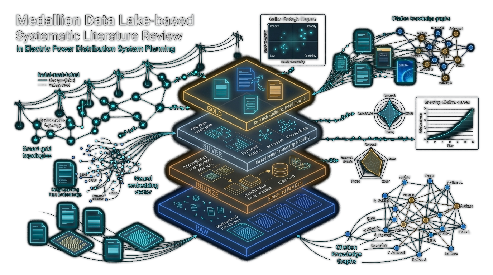
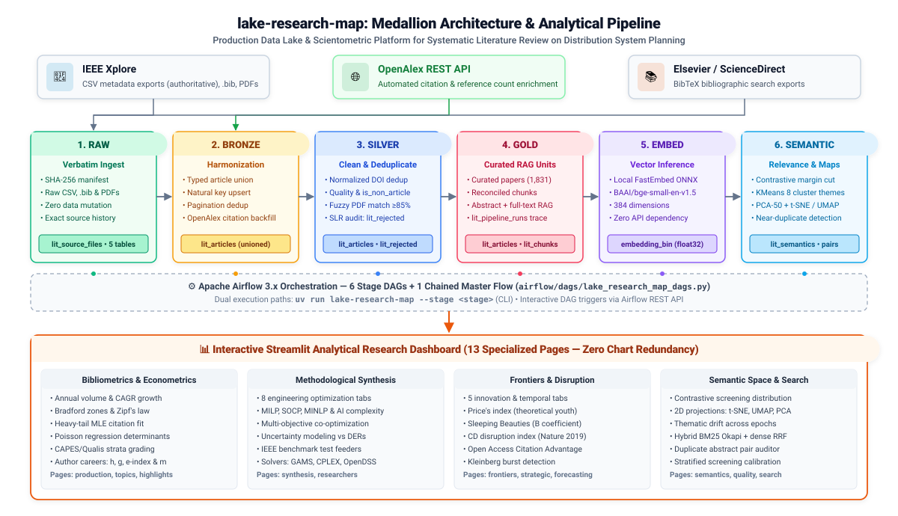

# lake-research-map

[](https://www.python.org/downloads/)
[](tests/)
[](https://github.com/astral-sh/uv)
[](src/lake_research_map/dashboard/)
[](airflow/)
[](src/lake_research_map/db/)
[](https://github.com/astral-sh/ruff)
[](LICENSE)



`lake-research-map` is a production-grade **Medallion Data Lake**, automated ETL pipeline, and scientometric research platform engineered for a Systematic Literature Review (SLR) on:
> **"Distribution System Planning" (Electric Power Distribution Networks)**

It transforms raw, heterogeneous, and partial bibliographic search exports from **IEEE Xplore** and **Elsevier ScienceDirect** (~1,831 deduplicated articles, 6,235 text chunks) into a structured, audit-ready, RAG-enabled corpus. Without writing direct SQL queries, researchers explore deep scientometric, econometric, network, and semantic dynamics through an interactive 13-page Streamlit analytical dashboard orchestrated by Apache Airflow.

---

## 📑 Table of Contents

- [The Systematic Literature Review (SLR) Challenge](#-the-systematic-literature-review-slr-challenge)
- [Medallion Data Lake Architecture](#-medallion-data-lake-architecture)
  - [Pipeline Stages](#pipeline-stages)
  - [Multi-Project Database Isolation](#multi-project-database-isolation)
  - [Binary Vector Embeddings (`LargeBinary` float32)](#binary-vector-embeddings-largebinary-float32)
- [Interactive Analytical Dashboard (13 Pages)](#-interactive-analytical-dashboard-13-pages)
- [Scientometric, Econometric & Machine Learning Rigor](#-scientometric-econometric--machine-learning-rigor)
- [Quickstart & Deployment](#-quickstart--deployment)
  - [Prerequisites & Setup](#prerequisites--setup)
  - [Pipeline CLI Execution](#pipeline-cli-execution)
  - [Streamlit Dashboard](#streamlit-dashboard)
  - [Airflow & Multi-Container Deployment](#airflow--multi-container-deployment)
- [Testing & Quality Assurance](#-testing--quality-assurance)
- [Project Directory Structure](#-project-directory-structure)
- [Documentation & Architectural Standards](#-documentation--architectural-standards)

---

## ⚡ The Systematic Literature Review (SLR) Challenge

Modern electric power distribution networks are undergoing unprecedented architectural shifts driven by the integration of Distributed Energy Resources (DERs, rooftop solar PV, wind generation), Battery Energy Storage Systems (BESS), Electric Vehicle (EV) fast-charging hubs, microgrids, and extreme weather climate resilience mandates. Synthesizing decades of mathematical optimization and planning methodologies requires navigating thousands of academic papers.

Doing this manually from raw publisher exports presents severe methodological roadblocks:

1. **Heterogeneous Publisher Formats**: IEEE Xplore exports metadata CSVs alongside paginated `.bib` files and bulk PDF packages. Elsevier ScienceDirect exports paginated `.bib` files only. IEEE BibTeX exports concatenate entries without newlines or separators (`month={Feb},}@ARTICLE{...`), breaking standard parsers.
2. **DOI Discrepancies**: Elsevier provides full URL DOIs (`https://doi.org/10.1016/...`), while IEEE provides bare DOI strings (`10.1109/...`). Without strict canonical normalization (stripping URL prefixes, trimming whitespace, and casefolding), deduplication fails.
3. **Lexical Ambiguity (The Logistics Distraction)**: The keyword query `"distribution system planning"` is polysemous. In addition to electric power distribution networks, it matches supply-chain management, warehouse locations, and freight logistics literature (~9% of raw search results). Crude keyword exclusions risk dropping valid interdisciplinary papers; `lake-research-map` solves this via **contrastive semantic screening**.
4. **Corpus Partiality & Auditability**: Out of 1,836 ingested bronze records, 1,831 survive DOI deduplication (with zero overlap between publishers under the current search window), and 96 have associated full-text PDFs (5.2%). The pipeline captures partiality explicitly, logging every dropped row to `silver.lit_rejected` to maintain PRISMA-compliant SLR audit trails.

---

## 🏗️ Medallion Data Lake Architecture

The pipeline implements a 6-tier Medallion architecture orchestrated by Apache Airflow and managed through SQLAlchemy 2.0 declarative models:



### Pipeline Stages

| Stage | Target Database / Table | Core Responsibilities |
|---|---|---|
| **1. Raw** | `raw.lit_*` | Verbatim, immutable ingestion of IEEE CSVs, BibTeX entries, config files, and PDF manifests. Sha256 content hashing (`lit_source_files`) guarantees idempotent execution (unchanged files are skipped). |
| **2. Bronze** | `bronze.lit_articles` | Cross-source schema harmonization unioning IEEE and Elsevier fields. Collapses within-source pagination duplicates and enriches records with citation/reference backfills via OpenAlex REST API (`data/enrichment_cache.json`). |
| **3. Silver** | `silver.lit_articles`<br>`silver.lit_rejected` | Deduplicates records by normalized DOI into single authoritative paper records. Tags non-article items (prefaces, book covers), executes fuzzy title matching against PDFs via `rapidfuzz` ($\ge 85$), and logs dropped rows without DOIs to `silver.lit_rejected`. |
| **4. Gold** | `gold.lit_articles`<br>`gold.lit_chunks`<br>`gold.lit_pipeline_runs` | Curated research layer. Splits abstracts and available full texts into RAG chunk units (`lit_chunks`) with invalidation-aware hash reconciliation (unchanged text preserves existing embeddings). Records run metrics and status to `lit_pipeline_runs`. |
| **5. Embed** | `gold.lit_chunks.embedding_bin` | In-process vectorization using local ONNX-accelerated `fastembed` (`BAAI/bge-small-en-v1.5`, 384 dimensions). Bypasses cloud API rate limits, processing only records where `embedding_bin IS NULL`. |
| **6. Semantic** | `gold.lit_semantics`<br>`gold.lit_duplicate_pairs` | Contrastive semantic screening (calculates margin $\Delta = \cos(\mathbf{e}_i, \mathbf{a}_{\text{topic}}) - \cos(\mathbf{e}_i, \mathbf{a}_{\text{logistics}})$). Generates 2D manifold projections (t-SNE, UMAP, PCA 2D), discovers themes, and surfaces near-duplicate abstracts ($S_C \ge 0.95$) under distinct DOIs. |

### Multi-Project Database Isolation

The underlying MySQL server hosts multiple discrete databases named plainly after the medallion tiers: `raw`, `bronze`, `silver`, and `gold`. These databases are shared with unrelated projects (e.g., `fastf1_results`, `personal_expenses`).

> [!IMPORTANT]
> To preserve multi-tenant isolation, `lake-research-map` strictly queries and modifies tables bearing the `lit_` prefix. Non-`lit_` tables are completely ignored by migrations, queries, and automated tests.

### Binary Vector Embeddings (`LargeBinary` float32)

Vector embeddings for RAG retrieval and manifold projections are stored directly as native IEEE 754 float32 byte arrays (`LargeBinary` in MySQL):
- **82% Storage Footprint Reduction**: Binary serialization drops per-vector storage from ~8.5 KB (JSON array of floats) to **1,536 bytes** (`384 * 4 bytes`), reducing chunk table size from ~50 MB to ~9 MB.
- **Zero-Copy In-Memory Vectorization**: Deserialization executes instantaneously via `np.frombuffer(raw_bytes, dtype=np.float32)`, eliminating JSON parsing bottlenecks and accelerating in-memory k-NN vector search by 5–10x.

---

## 📊 Interactive Analytical Dashboard (13 Pages)

The Streamlit dashboard (`src/lake_research_map/dashboard/`) is partitioned into **13 dedicated pages** with **zero chart redundancy across tabs**. Visualizations dynamically adapt to both dark and light modes through transparent polar/radar styling and modern responsive containers (`width="stretch"`).

| Page | Portuguese Title | Analytical Scope & Dedicated Tabs |
|---|---|---|
| **Overview** | *Visão Geral* | High-level macro summaries: headline article counts, publisher split, publication timeline, and editorial concentration. |
| **Output Over Time** | *Volume & Produção* | Strictly chronological views: Annual volume trends, Cumulative growth by venue, Publisher share over time (IEEE vs. Elsevier), and CAPES/Qualis strata longitudinal evolution. |
| **Topics & Venues** | *Tópicos & Periódicos* | Unified venue ranking (Volume vs. Impact toggle), Bradford's 3-zone core-periphery scattering, class-based dynamic c-TF-IDF topic vocabularies, Zipf's Law rank-frequency regression, Chow test structural breaks, and Brian Uzzi conceptual atypicality. |
| **Highlights & Impact** | *Destaques & Impacto* | **Tab 1: Fundamentação Teórica**: Reference distribution viewer, References vs. Citations scatter, Top referenced seminal works.<br>**Tab 2: Dinâmica de Citações & Econometria**: Top cited articles, Annual citation curves, Heavy-tail MLE fitting (Power-Law vs. Log-Normal), Age-normalized citation percentiles, and Poisson GLM regression. |
| **Researchers** | *Pesquisadores & Redes* | Comprehensive Author Hub across 6 tabs: Productivity ranking, Scientific leadership ($h, g, e, m$-indices), Career trajectories, Louvain co-authorship community network & Small-World topology ($\sigma$), Research lines, and Lotka's Law of scientific productivity. |
| **Semantics & Relevance** | *Semântica & Relevância* | Contrastive margin distribution ($\Delta = 0$ threshold), Multi-projection 2D map (t-SNE / UMAP / PCA 2D) with KDE contours, Discovered KMeans themes, Cosine outlier semantic novelty, and Near-duplicate abstracts under distinct DOIs. |
| **Trends & Forecast** | *Tendências & Previsão* | Candidate volume regression models with dynamic expanding prediction intervals ($\sigma \sqrt{h}$), Rolling-origin cross-validation, Quantile regression uncertainty bands (P10/P50/P90), Keyword trajectories, and Continuous Non-Linear Least Squares (NLS) Bass innovation diffusion ($p, q, m$). |
| **Strategic Scientometrics** | *Cienciometria Estratégica* | Callon's Strategic Diagram (1991) positioning themes by density vs. centrality across 4 quadrants, Jaccard-weighted keyword co-occurrence graph, Thematic centroid similarity matrix ($8 \times 8$), Transparent 5-axis maturity radar, Spearman rank correlation matrix, Longitudinal Shannon thematic entropy, and International research collaboration networks. |
| **Methodological Synthesis** | *Evidências Metodológicas* | 7 engineering optimization tabs: Mathematical complexity spectrum (MILP, SOCP, MINLP, Metaheuristics, AI/RL), Multi-objective co-optimization taxonomy (Costs, Losses, Reliability, Voltage, Emissions, Resilience), Uncertainty paradigms (Stochastic, Robust, Fuzzy, DRO, Chance-Constrained) cross-referenced with DER physical resources, Multi-stage vs. static planning horizons, IEEE benchmark test feeders (33, 69, 123-bus, real grids), Exact solvers & power simulators (GAMS, CPLEX, Gurobi, OpenDSS, MATLAB), and Citation longevity & text stylometrics (Flesch, FKGL, TTR). |
| **Technological Frontiers** | *Frentes Tecnológicas* | Derek de Solla Price's (1965) Index of theoretical recency, Delayed-recognition Sleeping Beauties ($B$ coefficient, Ke et al. 2015), Wu, Wang & Evans (Nature 2019) $CD$ disruption index, Open Access Citation Advantage (OACA), and Kleinberg (2002) hierarchical burst detection. |
| **Layers & Pipeline** | *Camadas & Pipeline* | Medallion funnel conversion metrics, Cross-layer schema drift checks, Execution run history (`lit_pipeline_runs`), Rejected records SLR audit (`lit_rejected`), and Pipeline DAG execution triggers. |
| **Quality & RAG** | *Qualidade & RAG* | Metadata richness scores, Full-text PDF coverage, Chunk and embedding readiness, Isolation Forest bibliometric anomaly detection, and Hybrid BM25 Okapi + Dense Vector Search with Reciprocal Rank Fusion (RRF). |
| **Search Configuration** | *Configuração da Busca* | Audit inspection of raw provenance from `data/ieee/config.csv` and `data/elsevier/config.csv` (exact query strings, Boolean syntax, search dates, filters). |

---

## 🔬 Scientometric, Econometric & Machine Learning Rigor

All analytical functions reside in `dashboard/analytics.py` and `dashboard/forecasting.py` as **pure, stateless mathematical functions** independent of Streamlit and MySQL:

```
                                  ANALYTICAL RIGOR
 ┌───────────────────────────────────────┬──────────────────────────────────────────┐
 │ Scientometrics & Bibliometrics        │ Formulations & Algorithmic Foundations    │
 ├───────────────────────────────────────┼──────────────────────────────────────────┤
 │ Contrastive Relevance Screening       │ Δ = cos(e_i, a_topic) - cos(e_i, a_log)   │
 │ Bass Innovation Diffusion             │ f(t) = (p+q)^2 / p * e^-(p+q)t / (1+q/p)  │
 │ Dynamic Prediction Intervals          │ ŷ_{t+h} ± 1.96 * σ_ε * √h                │
 │ Hybrid Retrieval (RRF)                │ RRF(d) = Σ 1 / (60 + rank_m(d))          │
 │ Price's Index of Theoretical Recency  │ P = N_{refs ≤ 5y} / N_{refs}             │
 │ Sleeping Beauties Beauty Coefficient  │ B = Σ [((c_m - c_0)/t_m)*t + c_0 - c_t]  │
 │ CD Disruption Index (Wu et al. 2019)  │ CD = (n_f - n_b) / (n_f + n_b + n_r)     │
 │ Conceptual Atypicality (Uzzi 2013)    │ z_ij = (obs_ij - μ_ij) / σ_ij            │
 │ Small-World Network Topology          │ σ = (C / C_rand) / (L / L_rand)          │
 │ Zhang's Excess Impact Index           │ e^2 = Σ_{i=1}^h c_i - h^2                │
 └───────────────────────────────────────┴──────────────────────────────────────────┘
```

---

## 🚀 Quickstart & Deployment

### Prerequisites & Setup

Requires [uv](https://docs.astral.sh/uv/) (Python 3.13) and an accessible MySQL instance:

```bash
# 1. Clone repository
git clone https://github.com/rvanguita/lake-research-map.git
cd lake-research-map

# 2. Sync virtual environment and lockfile
uv sync

# 3. Configure environment
cp .env.example .env
# Configure MYSQL_HOST, MYSQL_PORT, MYSQL_USER, MYSQL_PASSWORD in .env
```

### Pipeline CLI Execution

Run pipeline stages directly via the `lake-research-map` CLI:

```bash
# Execute full pipeline end-to-end (bootstraps schemas, runs all 6 stages)
uv run lake-research-map --stage all

# Execute discrete stages independently
uv run lake-research-map --stage raw        # Ingest raw publisher exports
uv run lake-research-map --stage bronze     # Schema harmonization + OpenAlex backfill
uv run lake-research-map --stage silver     # DOI deduplication, PDF matching, reject logging
uv run lake-research-map --stage gold       # Curated articles, chunks, telemetry
uv run lake-research-map --stage embed      # Local ONNX binary vector embeddings
uv run lake-research-map --stage semantic   # Contrastive screening, themes, projections

# Schema bootstrap & additive column migration
uv run python -m lake_research_map.db.bootstrap
```

### Streamlit Dashboard

Launch the analytical dashboard locally:

```bash
uv run streamlit run main.py
```
Open [http://localhost:8501](http://localhost:8501) in your browser.

### Airflow & Multi-Container Deployment

Run Airflow and the dashboard simultaneously using Docker Compose:

```bash
docker compose up -d
```

- **Streamlit Dashboard**: [http://localhost:8501](http://localhost:8501)
- **Apache Airflow UI**: [http://localhost:8080](http://localhost:8080) (Default login: `admin` / `admin`)

Airflow DAGs (`airflow/dags/lake_research_map_dags.py`) execute stages via `BashOperator` calling `uv run lake-research-map --stage <stage>`. Pipeline logic runs identically whether triggered via CLI, Streamlit UI, or Airflow REST API.

---

## 🧪 Testing & Quality Assurance

The codebase features an exhaustive automated test suite:
- **186 tests across 22 test files** executing in **< 6 seconds**.
- **Zero Live MySQL Dependency**: All tests execute against isolated, in-memory SQLite fixtures (`tests/conftest.py`) replicating the multi-layer medallion schemas.

```bash
# Run full automated test suite
uv run pytest

# Execute static analysis and linting
uv run ruff check

# Verify formatting compliance
uv run ruff format --check
```

### Pre-Commit Security & Branch Protection

Pre-commit hooks are configured to enforce security and architectural standards:
```bash
uv tool install pre-commit
pre-commit install
```
- **Gitleaks**: Scans staged diffs for hardcoded passwords, tokens, and private keys.
- **Block Docs on Main** (`scripts/git-hooks/check-docs-branch.sh`): Prevents direct documentation commits to `main`, requiring dedicated feature or `docs/*` branches.

---

## 📂 Project Directory Structure

```
lake-research-map/
├── src/lake_research_map/
│   ├── config.py                 # Pydantic environment & database configuration
│   ├── pipeline.py               # Medallion CLI controller (run_raw, run_bronze, etc.)
│   ├── db/                       # SQLAlchemy 2.0 multi-database models
│   │   ├── raw_models.py         # lit_source_files, lit_config, lit_bib_entries
│   │   ├── bronze_models.py      # lit_articles union schema
│   │   ├── silver_models.py      # lit_articles deduplicated, lit_rejected audit log
│   │   ├── gold_models.py        # lit_articles, lit_chunks, lit_semantics, lit_pipeline_runs
│   │   ├── engines.py            # Layer database session factories
│   │   └── bootstrap.py          # Table creation and additive column migrations
│   ├── ingest/                   # Raw parsing & API enrichment
│   │   ├── raw_csv.py            # IEEE CSV parser
│   │   ├── raw_bib.py            # Robust BibTeX parser (handles no-separator gotcha)
│   │   ├── raw_pdfs.py           # PDF manifest inventory
│   │   ├── raw_config.py         # Search query provenance parser
│   │   ├── openalex.py           # OpenAlex REST enrichment client
│   │   └── hashing.py            # Sha256 idempotency hashing
│   ├── transform/                # Medallion transformations
│   │   ├── bronze_articles.py    # Schema unification
│   │   ├── silver_articles.py    # Normalized DOI dedup & RapidFuzz PDF matching
│   │   ├── gold_articles.py      # Curated RAG chunks with hash reconciliation
│   │   ├── embeddings.py         # Local ONNX fastembed vectorization (LargeBinary float32)
│   │   ├── semantics.py          # Contrastive screening, KMeans, UMAP/t-SNE/PCA
│   │   └── screening_calibration.py # SLR sensitivity/recall threshold calibration
│   └── dashboard/                # Multipage Streamlit application
│       ├── app.py                # Dashboard navigation & router
│       ├── data.py               # Raw SQL data layer
│       ├── loaders.py            # @st.cache_data caching and normalization
│       ├── analytics.py          # Pure mathematical, scientometric & network analytics
│       ├── forecasting.py        # Regression benchmarking, quantiles, Bass diffusion
│       ├── search.py             # Hybrid BM25 Okapi + Dense Vector Faiss/RRF search
│       ├── theme.py              # Dark/light theme tokens and transparent polar styling
│       ├── components.py         # Reusable Streamlit UI widgets & metric cards
│       ├── airflow_client.py     # Airflow REST API client
│       └── pages/                # 13 modular, deduplicated analytical controllers
├── airflow/                      # Airflow DAGs mirroring CLI pipeline stages
│   └── dags/lake_research_map_dags.py
├── docs/                         # Architecture, product specs, and assets
│   ├── PRD.md                    # Product Requirements Document
│   ├── SDD.md                    # System Design Document
│   ├── ROADMAP.md                # Strategic research & feature backlog
│   └── images/
│       ├── lake_research_map_hero.png # Transparent RGBA hero illustration
│       ├── architecture.svg      # Legacy pipeline architecture diagram
│       └── medallion_architecture.svg # Modern white-background medallion architecture diagram
├── scripts/git-hooks/            # Pre-commit hook shell scripts
├── tests/                        # 186 unit/integration tests (SQLite in-memory)
├── AGENTS.md                     # Universal guidelines for AI assistants
├── CLAUDE.md                     # Source-data quirks and environment notes
├── docker-compose.yml            # Airflow + Dashboard container orchestration
└── pyproject.toml                # Project metadata, dependencies, and Ruff config
```

---

## 📖 Documentation & Architectural Standards

For in-depth documentation and contributor guidelines:
- **System Design Document**: [`docs/SDD.md`](docs/SDD.md) — Exhaustive technical architecture, schema specifications, and algorithmic formulas.
- **Product Requirements Document**: [`docs/PRD.md`](docs/PRD.md) — Motivation, 15 user personas, functional specifications, and acceptance criteria.
- **Strategic Roadmap**: [`docs/ROADMAP.md`](docs/ROADMAP.md) — Active research directions, validation metrics, and improvement backlog.
- **AI Assistant Guidelines**: [`AGENTS.md`](AGENTS.md) — Universal rules, testing standards, and Streamlit conventions for AI pairs.
- **Corpus Parsing Gotchas**: [`CLAUDE.md`](CLAUDE.md) — Raw publisher data quirks, BibTeX separators, and DOI matching nuances.

---

## ⚖️ License

This project is licensed under the MIT License — see the [LICENSE](LICENSE) file for details.
